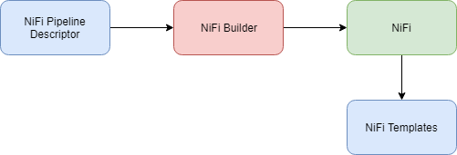
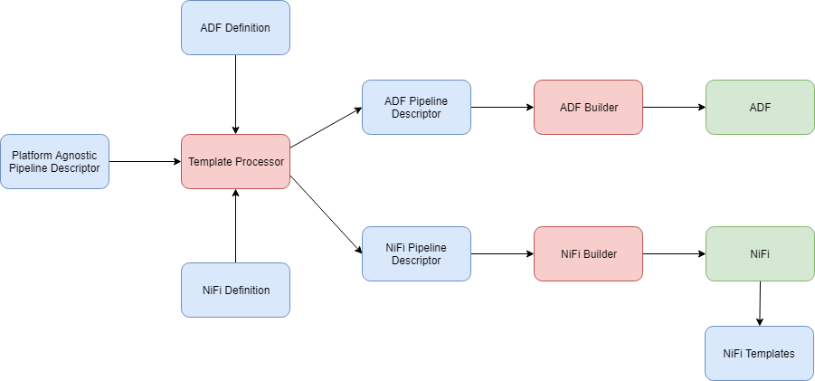

# NiFi Builder

NiFi Builder provides a command line interface for building and updating NiFi data pipelines, defined using a pipeline descriptor in JSON.

* Abstract NiFi API complexity and encapsulate into a NiFi client.
* Enable multi-target and multi-platform pipeline generation with support for a variety of platforms.
* Enable fast development and maintenance by avoiding developer copy/paste.

## NiFi Builder Design Overview

To build a NiFi pipeline the NiFi Builder reads a NiFi Pipeline Descriptor and executes it against the NiFi REST API.



The Pipeline Descriptor is a JSON document which describes the different steps of acquiring the data and parameters to be set. The steps are mapped to NiFi templates.

### NiFi Pipeline Descriptor Example

Below is presented a sample pipeline descriptor for fetching files from a `source` folder on the local file system (in Windows system), unzipping the files and storing them into a `landing` folder.

```json
{
    "name": "Demo CSV Ingest",
    "description": "Ingest CSV file from local filesystem.",
    "parameters": {
        "sdp_input_dir": "C:\\Sandbox\\notebooks\\repo\\nifi_factory\\data\\source",
        "sdp_output_dir": "C:\\Sandbox\\notebooks\\repo\\nifi_factory\\data\\landing"
    },
    "pipeline": {
        "steps": [
            {
                "name": "AcquireLocal",
                "type": "sdp_tpl_AcquireLocalFiles",
                "description": "Acquire files from local directory",
                "variables": {
                    "sdp_input_dir": "{sdp_input_dir}"
                }
            },
            {
                "name": "Unzip",
                "type": "sdp_tpl_UnzipFiles",
                "description": "Unzip Files"
            },
            {
                "name": "StoreLocal",
                "type": "sdp_tpl_PutLocalFiles",
                "variables": {
                    "sdp_output_dir": "{sdp_output_dir}"
                }
            }
        ]
    }
}
```


## Multi-target and Multi-Platform Generation Approach



## Features

* Create NiFi Process Group to wrap the data pipeline.
  * Support `name`  - Process Group Name is updated
  * Support `description` (optional) - Process Group `Comments` updated with the description.
* Enable existing pipeline overwriting through command line parameter.
* Arbitrary templated steps could be specified
  * Support `name` - Step (Process Group) Name is updated
  * Support `description` (optional) - Step Process Group Description is updated
  * Support `variables` (optional) - Step variables are updated
* Automatic connection discovery ( `out` --> `in`) between steps.
* Parameters could be defined
  * String formatting (template replacement) for variable string expressions (See https://docs.python.org/3.4/library/string.html#format-string-syntax on Python string formatting)
* Specify the NiFi address from command line.
  * If NiFi address is not specified, use http://localhost:8080 as default
* Automatically layout data pipelines to avoid overlapping.
  * Replaced pipeline origin is preserved.
* Define variables at Pipeline level  - useful to inherit variables from Pipeline level or global. (+)
  - As data acquisition manager I need a capability to specify variables for the pipeline process group so that these variables could be used by steps.
* Remove variables from steps - useful to inherit variables from Pipeline level or global. (+)
  - As data acquisition manager I need a capability to specify certain variables to be removed from a step so that these variables could be taken from the outer scope.
* Parameters can be passed from a separate configuration file to enable environment specific configurations, e.g. sensitive properties.
* Process properties could be updated to enable setting sensitive properties during flow generation.
* NiFi Builder could be started as web service to build fixed pipeline to enable debugging.

## Stories Backlog

1. Define root process group where to place the generated pipeline to enable more manageable and structured stream organization.
2. Full featured REST service which could be configured and deployed as Azure Web App.
3. Integrate with NiFi CI/CD pipeline.
4. Support yaml as pipeline and configuration definition format to enable comments and (somehow) improve readability.
5. Define pipeline outbound/inbound connections (from/to external pipelines/processors) (+)
   - As data acquisition manager I need to be able to specify inbound and outbound connections for the pipeline so that it can receive data or send data to other pipelines.
6. Ability to upload templates in automated way.
7. Passing parameters for expression formatting from command line - for reuse of parameters across pipelines. (-)
8. Define connections in the pipeline descriptor. - to support arbitrary complexity and steps with multiple inputs/outputs.  (-)
9. Read Pipeline Descriptor from STDIN - useful for Multi-target/platform generation. (-)
10. Instantiate pipeline steps from NiFi Registry (-)
11. Commit pipeline to NiFi Registry (-)
12. Interactive debugger for NiFi Builder.

## Starting the NiFi Builder

To Start NiFi Builder:

```bash
python .\bin\nifi-builder.py <filename>
```

Where `<filename>` points to a JSON pipeline descriptor.

The general NiFi Builder command-line syntax is as follows:

```
usage: nifi-builder.py [-h] [-u NIFI_URL] [-o] filename

NiFi Flow Builder

positional arguments:
  filename

optional arguments:
  -h, --help            show this help message and exit
  -u NIFI_URL, --nifi-url NIFI_URL
                        URL for the NiFi server. Default URL:
                        http://localhost:8080
  -o, --overwrite       Overwrite existing pipeline.
```


## Pipeline Descriptor Template


```json
{
    "name": "/* Data Flow Name */",
    "description": "/* Description for the data flow. */",
    "parameters": {
        "/* parameter name */": "/* parameter value */"
    },
    "pipeline": {
        "steps": [
            {
                "name": "/* Step Name */",
                "type": "/* NiFi Template Name */",
                "description": "/* Step Description */",
                "variables": {
                    "/* variable name */": "/* string expression */"
                }
            }
        ]
    }
}
```

