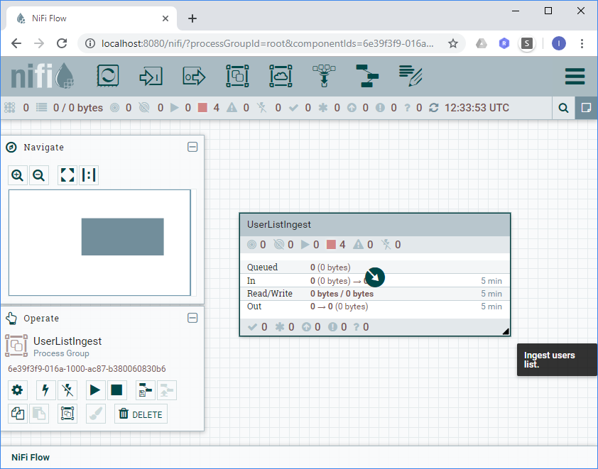
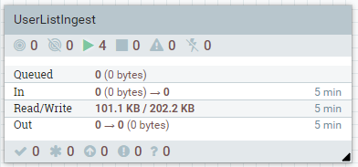

# Getting Started with NiFi Builder

## Introduction

In this lab we are going to explore how to use NiFi Builder by creating a NiFi data stream.

After completing this lab you should be able to:

1. Set-up a NiFi sandbox environment using Docker
2. Install NiFi Builder from Git repository
3. Create NiFi stream descriptor
4. Build NiFi stream with NiFi Builder

### Scenario

### Activities

To complete the lab, you are going to perform following activities:

1. Install NiFi Builder from Git Repository
2. Create a Docker container, running NiFi 
3. Upload NiFi templates
4. Define a NiFi stream by creating a stream descriptor 
5. Build NiFi stream from stream descriptor, using NiFi Builder
6. Take care of hard-coded values

### System Requiremens

In order to complete the lab, you need to have the following tools installed. I will also assume that you know how to use them. You can use any operating system - e.g. Windows, Linux or MacOS which supports the tools.

| Tool                | Description                                                  | I am using... |
| ------------------- | ------------------------------------------------------------ | ------------- |
| Python 3.6 or newer | NiFi Builder is written in Python and needs Python installed in order to run. | 3.6.5         |
| Docker 18 or newer  | We are going to use Docker to run NiFi sandbox. Although this is the recommended approach, it is not required that you use Docker. You can use any NiFi instance available to you. | 18.09.0       |
| Git client          | We are using git to install NiFi Builder from GitHub/Bitbucket. | GitScm        |
| Terminal shell      | In this lab I am using PowerShell. It is readily available in Windows 10. It is also available for Linux or Mac OS for free. If you prefer, you could use any compatible terminal shell, e.g. bash on Linux. | PowerShell    |
| Code editor         | You can use any text editor or IDE you are comfortable with. | Notepad++     |
| Operating System    | Windows, Linux or MacOS                                      | Windows 10    |
| Web Browser         | Chrome, Safari, Edge, etc.                                   | Chrome        |

### Support Files

From the support-files, you can [download a PowerShell script](support-files/lab-commands.ps1), containing all the commands from this lab commands from the support-files.

Here is a list of all support files:

| File Name                                                    | Description                                                  |
| ------------------------------------------------------------ | ------------------------------------------------------------ |
| [acquire-random-users.conf.nifib.json](support-files/acquire-random-users.conf.nifib.json) | Configuration file for NiFi Builder.                         |
| [acquire-random-users.def.nifib.json](support-files/acquire-random-users.def.nifib.json) | Stream definition for NiFi Builder - complete stream         |
| [acquire-random-users-hardcoded.def.nifib.json](support-files/acquire-random-users-hardcoded.def.nifib.json) | Stream definition for NiFi Builder - complete stream with hardcoded configuration. |
| [acquire-random-users-varsandexpressionlanguage.def.nifib.json](support-files/acquire-random-users-varsandexpressionlanguage.def.nifib.json) | Stream definition for NiFi Builder - complete stream with example, using expression language and variable manipulation. |
| [lab-commands.ps1](support-files/)                           | PowerShell script, containing all the commands from the lab. |
| [sdp_tpl_AcquireHTTP.xml](support-files/sdp_tpl_AcquireHTTP.xml) | NiFi template for acquiring data from HTTP endpoint.         |
| [sdp_tpl_StoreFile.xml](support-files/sdp_tpl_StoreFile.xml) | NiFi template for storing files in a local file system.      |
| [template.def.nifib.json](support-files/template.def.nifib.json) | Template stream definition for an empty NiFi Builder stream. |


## Instructions

### Activity 1. Install NiFi Builder from Git repository

In this activity we are going to install NiFi Builder and see how you can get help on the usage of the NiFi Builder command line parameters.

1. Create a root directory `LAB_ROOT` directory for the lab:

   ```powershell
   PS> $labRoot="C:/Sandbox/NiFiBuilderLab"
   PS> mkdir -p $labRoot
   PS> cd $labRoot
   ```

   Above commands are going to create an empty directory. The name of the directory is stored in a PowerShell variable, named `$labRoot`. We are going to put all the artifacts, used in this lab, under the `$labRoot` directory.

2. Clone the NiFi Builder repository from GitHub

   ```powershell
   PS> git clone https://github.com/vancun/nifi_factory
   ```

   Here is a sample output:

   ```
   Cloning into 'nifi_factory'...
   remote: Enumerating objects: 167, done.
   remote: Counting objects: 100% (167/167), done.
   remote: Compressing objects: 100% (102/102), done.
   remote: Total 167 (delta 69), reused 151 (delta 53), pack-reused 0
   Receiving objects: 100% (167/167), 599.40 KiB | 1.72 MiB/s, done.
   Resolving deltas: 100% (69/69), done.
   ```

   With this step you will clone the master branch of the NiFi Builder repository.

3. Test your installation:
   Run the following command to test the NiFi Builder is correctly installed.

   ```bash
   PS> python nifi_factory/bin/nifi-builder.py
   ```

   Because you didn't supply any parameters, this should show the short usage information:

   ```
   usage: nifi-builder.py [-h] [-u NIFI_URL] [-c CONFIG_FILE] [-o]
                          [--bind-port BIND_PORT]
                          filename
   nifi-builder.py: error: the following arguments are required: filename
   ```

4. Get help on command line parameters
   You can use the `-h` command line option to get extended usage information:

   ```bash
   PS> python nifi_factory/bin/nifi-builder.py -h
   ```

   This is very useful in case you do not know the exact command line argument or are not sure how it is used.

   ```
   usage: nifi-builder.py [-h] [-u NIFI_URL] [-c CONFIG_FILE] [-o]
                          [--bind-port BIND_PORT]
                          filename
   
   NiFi Flow Builder
   
   positional arguments:
     filename
   
   optional arguments:
     -h, --help            show this help message and exit
     -u NIFI_URL, --nifi-url NIFI_URL
                           URL for the NiFi server. Default URL:
                           http://localhost:8080
     -c CONFIG_FILE, --config-file CONFIG_FILE
                           Additional json configuration file.
     -o, --overwrite       Overwrite existing pipeline.
     --bind-port BIND_PORT
   ```


### Activity 2. Create a Docker container, running NiFi

In this activity we are going to setup a running standalone NiFi instance. The instance will run as a sandbox inside a Docker container. 

1. Create a Docker container

   > **WARNING!** Following command will download huge files (more than 1GB) from Internet. Make sure you are not on a metered Internet connection.

   Because NiFi Execute the following command in a bash terminal:

   ```powershell
   PS> docker run --rm -d -p 8080:8080 --name nifibuilderlab apache/nifi:1.8.0
   ```

   In this command we used following docker arguments:

   | Argument                | Purpose                                                      |
   | ----------------------- | ------------------------------------------------------------ |
   | `run`                   | Create a container from the specified image and run it.      |
   | `--rm`                  | Automatically remove the container after it is stopped. Very useful for sandbox environments. |
   | `-d`                    | Detach. Run the container in background and print the container ID. Used for daemons. |
   | `-p 8080:8080`          | Port 8080 from the container will be mapped to port 8080 on the host machine. |
   | `--name nifibuilderlab` | Give the container a name `nifibuilderlab`                   |
   | `apache/nifi:1.8.0`     | Docker image name. If the image doesn't exist locally, it will be downloaded from Docker hub along with all the dependencies. |

2. Explore NiFi Environment Variables

   Execute following command:

   ```powershell
   PS> docker exec -ti nifibuilderlab bash -c "env | grep NIFI"
   ```

   The command will list all the environment variables in the NiFi container, related to NiFi environment (which have NIFI in the name):

   ```
   NIFI_HOME=/opt/nifi/nifi-current
   NIFI_LOG_DIR=/opt/nifi/nifi-current/logs
   NIFI_TOOLKIT_HOME=/opt/nifi/nifi-toolkit-current
   NIFI_PID_DIR=/opt/nifi/nifi-current/run
   NIFI_BASE_DIR=/opt/nifi
   ```

   This might be useful if you need to interact with NiFi inside the container.

3. Open a web browser, e.g. Chrome

4. Navigate to NiFi

   Enter following URL in the Chrome address bar:

   ```
   http://localhost:8080/nifi
   ```

   The browser should show an empty NiFi Flow:

   


### Activity 3. Upload NiFi templates

To accomplish the lab, upload following NiFi templates from the support files:

* [sdp_tpl_AcquireHTTP.xml](support-files/sdp_tpl_AcquireHTTP.xml)
* [sdp_tpl_StoreFile.xml](support-files/sdp_tpl_StoreFile.xml)

### Activity 4. Create a stream descriptor to define a NiFi stream

1. Create a basic template descriptor and save it as a JSON file `lab/acquire-random-users.def.nifib.json`under the lab root folder. The template content is also available in the file [template.def.nifib.json](support-files/template.def.nifib.json) from the support files:

   ```json
   {
       "name": "UserListIngest",
       "description": "Ingest users list.",
       "properties": {
       },
       "pipeline": {
           "steps": [
           ]
       }
   }
   ```

   Some points worth to note:

   * The name of the file is not significant, but it is a good practice to follow naming conventions which could help to easily identify and structure your projects. I used three suffixes:
     * `.def` to indicate the purpose of the file. This is a stream definition file.
     * `.nifib` to indicate the application. This is a NiFi Builder file.
     * `.json` to indicate the file format. This is a JSON file.
   * The descriptor you created is complete. If you run the NiFi Builder with it, it will create an empty stream.
   * NiFi Builder will create a Process Group, named `UserListIngest`. It is used as a container for the stream steps.
   * Steps are defined by the `steps` array.
   * The `properties` map gives us a way to assign properties directly to NiFi processors. Using this feature violates good design practices and should be used only if there is no other option.

2. Add Acquire step to the stream definition:

   ```json
   {
       "name": "Acquire",
       "type": "sdp_tpl_AcquireHTTP",
       "description": "Acquire user list HTTP endpoint."
       "variables": {
           "sdp_flow_filename": "user-list.json"
       }
   }
   ```

   This definition instructs NiFi Builder to create a step, using the `sdp_tpl_AcquireHTTP` template. The step is wrapped in a NiFi Process Group. NiFi Builder will update the Process Group as follows:

   * Set the Process Group Name to "Acquire"
   * Update Process Group variables setting values as described. If you specify a variable with value `null`, NiFi will remove the variable.

3. Define following properties to be updated in the `properties` section:

   ```json
   "properties": {
       "UserListIngest/Acquire/GetHTTP": {
           "URL": "http://randomuser.me/api/?format=json&results=100&seed=abcde"
       }
   }
   ```

   We need to specify a `URL` for the source endpoint. Normally we would use a variable, but this would cause NiFi processor validation to fail, due to the implementation which would require in this case to create SSL context. This makes a case where NiFi processor properties feature is needed. Another use case is when we need to specify sensitive properties.

4. Add Store step to the stream definition:

   ```json
   {
       "name": "Store",
       "type": "sdp_tpl_StoreFile",
       "description": "Store files in the data platform storage.",
       "variables": {
           "sdp_dl_root": "/tmp/datalake",
           "sdp_source_id": "NiFiBuilderLab",
           "sdp_dataset_id": "RandomUser"
       }
   }
   ```

   NiFi builder will create a new step, called `Store`, using the `sdp_tpl_StoreFile`. The step will be configured to store the files in the `/tmp/datalake` folder.

   The template, follows the storage structure convention:

   ​	`${sdp_dl_root}/LANDING/${sdp_source_id}/${sdp_dataset_id}/INBOX` 

   We specify the corresponding variables. In big systems, the Store step might be shared among multiple streams. In this case it would be a good idea to tag the flow files with corresponding attributes.

5. Save and verify the stream definition.

   Here is a complete stream definition file `lab/acquire-random-users.def.nifib.json`.  You can [download the definition file](support-files/acquire-random-users-hardcoded.def.nifib.json) ready for use from the support files:

   ```json
   {
       "name": "UserListIngest",
       "description": "Ingest users list.",
       "properties": {
   		"UserListIngest/Acquire/GetHTTP": {
   			"URL": "http://randomuser.me/api/?format=json&results=100&seed=abcde"
   		}
       },
       "pipeline": {
           "steps": [
               {
                   "name": "Acquire",
                   "type": "sdp_tpl_AcquireHTTP",
                   "description": "Acquire user list HTTP endpoint.",
                   "variables": {
                       "sdp_flow_filename": "user-list.json"
                   }
               },
               {
                   "name": "Store",
                   "type": "sdp_tpl_StoreFile",
                   "description": "Store files in the data platform storage.",
                   "variables": {
                       "sdp_dl_root": "/tmp/datalake",
                       "sdp_source_id": "NiFiBuilderLab",
                       "sdp_dataset_id": "RandomUser"
                   }
               }
           ]
       }
   }
   ```


#### Summary

In this activity we created a complete NiFi stream definition. The stream is going to:

1. Read user list from HTTP endpoint 

   ​	 `http://randomuser.me/api/?format=json&results=100&seed=abcde`

2. Store the user list as a file named `user-list.json` inside the NiFi docker container into a directory 

   ​	`/tmp/datalake/LANDING/NiFiBuilderLab/RandomUser/INBOX/`

The lab root folder should have following content:

```
/
+-- lab
    +-- acquire-random-users.def.nifib.json
+-- nifi_factory
    # ... as checked out from GitHub ...
```

The flow definition contains hard-coded configuration strings, mixed with flow definition. You might want to structure your application so that you group configuration settings by environment, store sensitive parameters into a security vault, share settings between streams, flows, etc. 

This is a point for improvement. We will see one way how this could be improved by using configuration file in a later activity.


### Activity 5. Build NiFi stream from stream descriptor, using NiFi Builder

1. Open a shell session

2. Make sure you are in the lab root folder:

   ```powershell
   $labRoot="C:/Sandbox/NiFiBuilderLab"
   cd $labRoot
   ```

3. Start NiFi Builder, specifying the stream definition you have created earlier:

   ```powershell
   PS> python nifi_factory\bin\nifi-builder.py `
              lab\acquire-random-users.def.nifib.json
   ```

   Normally running NiFi Builder should show some debug information.

4. Navigate to NiFi UI: http://localhost:8080/nifi

   

5. Start the stream:

   

6. Stop the stream

7. Go to the shell and check the user list has been acquired and ingested:

   ```powershell
   PS> docker exec -ti nifibuilderlab bash `
        -c "cat /tmp/datalake/LANDING/NiFiBuilderLab/RandomUser/INBOX/*"
   ```

   The output is pretty verbose so I am not going to share it here. It presents the list of users in JSON format. You can see the expected output by opening the HTTP endpoint in a web browser.

#### Summary

We have our NiFi stream created by NiFi builder.

If you run NiFi builder, using the same command line, it will fail as the stream already exists. You have two choices:

* Manually delete the flow and re-run NiFi builder

* Re-run NiFi builder, adding `-o` or `--overwrite` . This will force NiFi Builder to first delete the stream and than create a new one. NiFi Builder will try to place the new stream at the same place on the NiFi Flow canvas.

  ```powershell
  PS> python nifi_factory\bin\nifi-builder.py -o `
             lab\acquire-random-users.def.nifib.json
  ```


### Activity 6. Take care of hard-coded values

1. Make sure the stream is stopped and you have navigated your NiFi UI to the root level.

2. Clear the data lake storage so that you could observe clear result:

   ```powershell
   PS> docker exec -ti nifibuilderlab bash -c "rm -rf /tmp/datalake"
   ```

   This command will remove the datalake folder and all its contents, including subfolders.

3. Create a NiFi Builder configuration file `lab/acquire-random-users.config.nifib.json`, extracting hardcoded configuration values. You can also [download the configuration file](support-files/acquire-random-users.conf.nifib.json) from the support files.

   ```json
   {
       "parameters": {
           "sdp_p_datalake_root": "/tmp/datalake",
           "sdp_p_nifibuilderlab_id": "NiFiBuilderLab",
           "sdp_p_nifibuilderlab_userlist_id": "RandomUser",
           "sdp_p_nifibuilderlab_userlist_url": "http://randomuser.me/api/?format=json&results=100&seed=abcde",
           "sdp_p_nifibuilderlab_userlist_filename": "user-list.json"
       }
   }
   ```

4. Modify the stream definition so that it refers to configuration parameters, instead of hardcoded values (see [acquire-random-users.def.nifib.json](support-files/acquire-random-users.def.nifib.json) from the support files).

5. Run NiFi Builder, specifying the stream definition and the configuration file. As already mentioned, the `-o` option forces NiFi Builder to overwrite the stream if it already exists:

   ```powershell
   PS> python nifi_factory\bin\nifi-builder.py -o `
              -c lab\acquire-random-users.conf.nifib.json  `
              lab\acquire-random-users.def.nifib.json
   ```

6. Refresh the NiFi UI, explore and execute the stream. Verify the output.

7. Sometimes you might need to specify that a value needs to be a NiFi Expression Language expression. NiFi expression language starts with a dollar sign and is enclosed in curly braces, for example: `${now()}`. NiFi builder uses curly braces for specifying value replacement. 
   To get curly braces in the output, you need to double them. In the NiFi Expression Language example, this would look the following way:

   ```
   ${{now()}}
   ```

   For training purposes, let's modify our stream definition ([updated flow definition](support-files/acquire-random-users-varsandexpressionlanguage.def.nifib.json) could be downloaded from the support files):

   * Promote the `sdp_flow_filename` variable from the Acquire step into a stream-level variable
   * Update the `Filename` attribute of the `GetHTTP` processor to use an expression language, refering to the `sdp_flow_filename` variable.

8. Add `variables` section to the flow definition:

   ```json
   "variables": {
       "sdp_flow_filename": "{sdp_p_nifibuilderlab_userlist_filename}"
   }
   ```

   This will create a stream-level variable, named `sdp_flow_filename`.

9. Set the `sdp_flow_filename` variable from the Acquire step to `null`:

   ```json
   "variables": {
       "sdp_flow_filename": null
   }
   ```

   This will cause that NiFi removes the variable definition from the step Process Group variables registry.

10. Add property value to be updated:

    ```json
    "UserListIngest/Acquire/GetHTTP": {
        "URL": "{sdp_p_nifibuilderlab_userlist_url}",
        "Filename": "${{sdp_flow_filename}}"
    }
    ```

11. Clean the datalake folder:

    ```powershell
    PS> docker exec -ti nifibuilderlab bash -c "rm -rf /tmp/datalake"
    ```

12. Start NiFi Builder:

    ```powershell
    python nifi_factory\bin\nifi-builder.py -o `
               -c lab\acquire-random-users.conf.nifib.json  `
               lab\acquire-random-users.def.nifib.json
    ```

13. Explore the generated stream:

    * Check the stream variables to confirm variable `sdp_flow_filename` has been created and value is assigned.
    * Check the Acquire step variables to confirm that `sdp_flow_filename` has been removed. 
      You will still see it, but it will be with scope `UserListIngest` , i.e. defined at stream-level.
    * Check the GetHTTP processor configuration to confirm that `Filename` is assigned a value of `${sdp_flow_filename}`

14. Start the stream in NiFi and verify the ingestion result:

    ```powerhsell
    PS> docker exec -ti nifibuilderlab bash `
          -c "cat /tmp/datalake/LANDING/NiFiBuilderLab/RandomUser/INBOX/* | head -n 3"
    
    ```


## Cleanup

This step is optional. You should be very careful when deleting resources (files, docker images etc.).

1. Stop the docker container. Docker will automatically remove it:

   ```powershell
   PS> docker stop nifibuilderlab
   ```

2. List docker images and copy the downloaded NiFi docker image ID (it occupies 1.83GB on my hard drive):

   ```powershell
   PS> docker image ls
   ```

   ```
   REPOSITORY         TAG       IMAGE ID            CREATED             SIZE
   apache/nifi        1.8.0     6c3cb8a4ae0e        6 months ago        1.83GB
   ```

3. Delete the NiFi docker image:

   ```powershell
   PS> docker image rm 6c3cb8a4ae0e
   ```

4. Remove the lab root folder and subfolders

   ```powershell
   PS> rm -Recurse -Force lab $labRoot
   ```

   If you are using bash, you should use:

   ```bash
   $ rm -rf $labRoot
   ```
